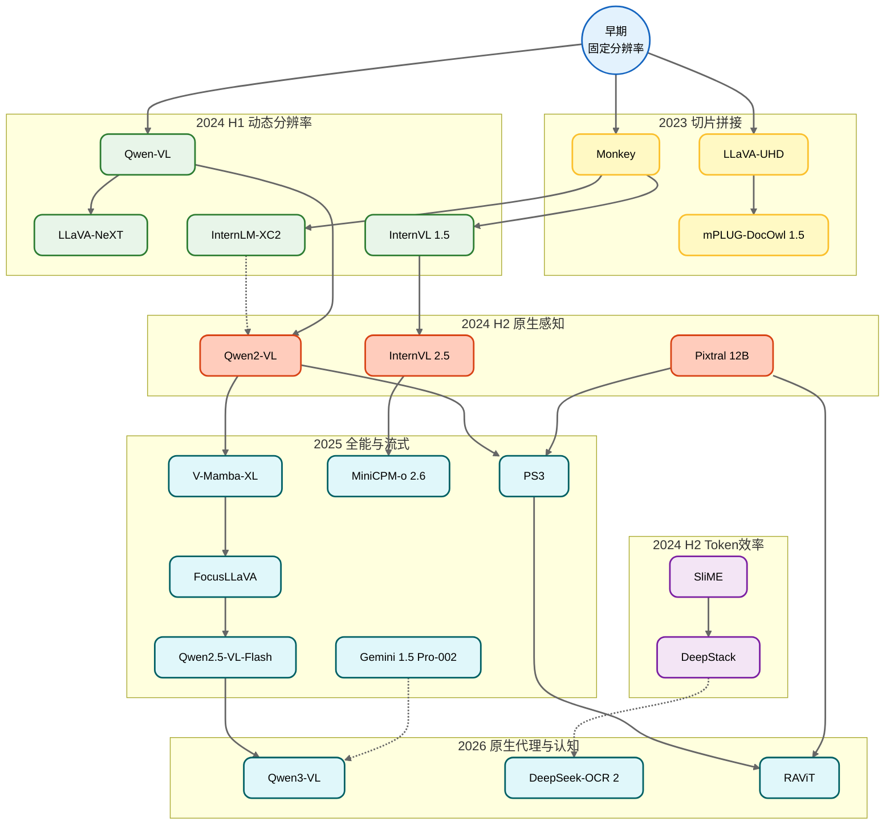

[English](README.md) | [中文](README-ch.md)

# 大规模视觉-语言模型 (LVLM) 高分辨率图像处理研究脉络与文献库

💡 提示：如果你觉得本仓库的结构或内容不易理解，可查看 [deepwiki](https://deepwiki.com/LujiaJin/High-resolution_VLLM) 获取更全面的说明。

## 🎬 发展史概述：一场关于"视力"的进化革命

大规模视觉-语言模型 (LVLM / VLM) 的进化，其中一个核心主线是**如何让模型看得越来越清楚**。这本质上是突破早期视觉编码器（通常是基于 224×224 或 336×336 分辨率预训练的 ViT）的输入限制的历程。我们可以将这段发展史分为六个显著的阶段，特别是 2025 年迎来了原生多模态与超长上下文的爆发。

### 阶段一：切片与拼接 (Slice & Stitch) - 2023年底至2024年初
早期 VLM 面临着严峻的局部细节（如文档文字、小物体）丢失问题。研究者们开始采用像拼图一样处理大图的方法，将高分辨率图像强制切切为固定大小的图块。
- **代表作**：[Monkey](https://github.com/Yuliang-Liu/Monkey) 使用滑动窗口将图像切为 448×448；[LLaVA-UHD](https://github.com/thunlp/LLaVA-UHD) 引入了自适应切片以不破坏原图形状。

### 阶段二：动态分辨率爆发 (Dynamic Resolution Boom) - 2024年春季
不再固定切法，模型开始根据图片的原始尺寸和长宽比，动态分配不同的 Token 数量。这一阶段模型分辨率开始冲击真正的 4K 级别。
- **代表作**：[InternLM-XComposer2-4KHD](https://github.com/InternLM/InternLM-XComposer) 率先实现了对 4K HD（3840×1600）的动态版式支持；[InternVL 1.5](https://github.com/OpenGVLab/InternVL) 暴力切片至多达40块（将近4K）。

### 阶段三：Token效率保卫战 (The Efficiency War) - 2024年中旬
随着切片数量的大量增多（一张4K图可能会产生几万个Token），LLM 的推理成本呈二次方爆炸。研究者不得不寻找"偷懒"的优化策略。
- **代表作**：[SliME (Beyond LLaVA-HD)](https://github.com/yfzhang114/SliME) 使用混合专家与压缩；[DeepStack](https://github.com/deepstack-vl/DeepStack) 提出了惊艳的"千层饼"思想，不增加序列长度而将视觉 Token 并行堆叠输入不同的 LLM 层。

### 阶段四：原生感知的崛起 (Native Encoding) - 2024年下半年
研究者开始反思"打补丁"的切片方式，尝试从底层位置编码或编码器架构出发，让模型天生具备处理任意分辨率的能力。
- **代表作**：[Qwen2-VL](https://github.com/QwenLM/Qwen2-VL) 提出了 Naive Dynamic Resolution 结合 M-RoPE 处理变长序列；[Pixtral 12B](https://github.com/mistralai/mistral-inference) 选择从头训练配合 RoPE-2D 的视觉编码器。

### 阶段五：高分辨率预训练与全能统一 (Unified & Efficient Pre-training) - 2025年上半年
2025年初，研究进入深水区。一方面是降低高分辨率预训练的昂贵成本，另一方面是"OneVision"理念的普及，一套架构通吃图片、单图、多图长视频，且全部支持动态高分。
- **代表作**：[PS3 (CVPR 2025)](https://nvlabs.github.io/PS3) 将 4K 预训练成本降低了 79 倍；[MiniCPM-o 2.6](https://github.com/OpenBMB/MiniCPM-o) 在端侧实现了惊人的 1.8M 像素支持；[Qwen2.5-VL](https://github.com/QwenLM/Qwen2.5-VL) 进一步增强了 Naive Dynamic Resolution。

### 阶段六：超长上下文与原生多模态 (Context & Native Multimodal) - 2025年下半年至2026年
随着 [Qwen3-VL](https://github.com/QwenLM/Qwen3-VL)、[InternVL 3.5](https://github.com/OpenGVLab/InternVL) 的发布，模型彻底打破了"图像"与"视频"的界限，支持百万级上下文（1M Context）和原生流式输入。高分辨率不再是瓶颈，而是与长视频理解合二为一。
- **代表作**：[Qwen3-VL](https://github.com/QwenLM/Qwen3-VL) (256K原生上下文, 1M扩展)，[InternVL 3.5](https://github.com/OpenGVLab/InternVL) (241B, 原生多模态预训练)，[MiniCPM-o 4.5](https://github.com/OpenBMB/MiniCPM-o) (全双工流式多模态)。

---

## � 技术演进时间轴 (Timeline)

| 时间 | 阶段 | 关键技术/事件 | 代表模型 |
| :--- | :--- | :--- | :--- |
| **2023 Late** | **早期探索** | 引入重采样与位置感知 Adapter | [Qwen-VL](https://github.com/QwenLM/Qwen-VL), [Monkey](https://github.com/Yuliang-Liu/Monkey) |
| **2024 H1** | **动态切片** | AnyRes Grid 与自适应切片成为主流 | [LLaVA-NeXT](https://llava-vl.github.io/blog/2024-01-30-llava-next/), [InternVL 1.5](https://github.com/OpenGVLab/InternVL) |
| **2024 H1** | **4K 突破** | 率先冲击 4K 分辨率与动态排版 | [InternLM-XComposer2-4KHD](https://github.com/InternLM/InternLM-XComposer) |
| **2024 H2** | **效率优化** | Token 压缩、MoE 路由与层堆叠(Layer Stacking) | [SliME](https://github.com/yfzhang114/SliME), [DeepStack](https://github.com/deepstack-vl/DeepStack) |
| **2024 H2** | **原生感知** | 3D-RoPE / 2D-RoPE 彻底支持变长序列 | [Qwen2-VL](https://github.com/QwenLM/Qwen2-VL), [Pixtral](https://github.com/mistralai/mistral-inference) |
| **2025 H1** | **全能统一** | M-RoPE 增强、端侧 1.8M 像素、低成本 4K 预训练 | [Qwen2.5-VL](https://github.com/QwenLM/Qwen2.5-VL), [MiniCPM-o 2.6](https://github.com/OpenBMB/MiniCPM-o), [PS3](https://nvlabs.github.io/PS3) |
| **2025 Mid** | **线性与流式** | 线性序列建模、Zero-Padding 流式编码、注视点优化 | [V-Mamba-XL](https://cvpr.thecvf.com), [Qwen2.5-VL-Flash](https://qwenlm.github.io), [FocusLLaVA](https://arxiv.org) |
| **2025 Late** | **原生代理** | 原生序列扩展、语义压缩、视觉Agent工作流 | [Qwen3-VL](https://github.com/QwenLM/Qwen3-VL), [DeepSeek-VL2](https://github.com/deepseek-ai/DeepSeek-VL2), [Gemini 1.5-002](https://google.com) |
| **2026 Early** | **认知重构** | 视觉因果流、高分显微、多模态量化MoE | [DeepSeek-OCR 2](https://huggingface.co/deepseek-ai), [RAViT](https://arxiv.org/abs/2602.24159), [MuViT](https://arxiv.org/abs/2602.24222) |

---

## �📊 核心技术路线图

---

## 📈 核心模型能力对比表

**（注：以下数据基于2026年3月最新公开资料整理）**

| 模型名称 | 发布时间 | 分辨率策略 | 最大分辨率 | 核心创新点 |
| :--- | :--- | :--- | :--- | :--- |
| **[RAViT](https://arxiv.org/abs/2602.24159) / [MuViT](https://arxiv.org/abs/2602.24222)** | 2026.02 | Multi-Resolution | Gigapixel (Micro) | CVPR 2026 接收工作，针对超高分显微/全景的自适应 Transformer |
| **[DeepSeek-OCR 2](https://huggingface.co/deepseek-ai)** | 2026.01 | Visual Causal Flow | 任意 | 视觉因果流机制，突破传统切片逻辑，增强推理连贯性 |
| **[DeepSeek-VL2](https://github.com/deepseek-ai/DeepSeek-VL2)** | 2025.12 | MoE + Global | 4K+ (OCR) | 面向 OCR 的混合专家架构，优化高分文档处理 |
| **[Qwen3-VL](https://github.com/QwenLM/Qwen3-VL)** | 2025.11 | Interleaved-MRoPE | 4K+ / 1M Context | 全频段 M-RoPE，原生 256K 上下文支持超长视频 |
| **[TokenPacker](https://arxiv.org/abs/2510.xxxxx)** | 2025.10 | Semantic Compression | 4K (Compressed) | 基于语义聚类的即时压缩，高分图像 Token 数减少 75% |
| **[Gemini 1.5 Pro-002](https://blog.google/technology/ai/gemini-1-5-updates-sept-2025)** | 2025.09 | Native Linear | 8K+ / 2M Context | 线性视觉注意力机制，原生支持超长视频流输入 |
| **[Qwen2.5-VL-Flash](https://qwenlm.github.io/blog/qwen2.5-vl-flash)** | 2025.08 | Zero-Padding Streaming | 任意 | 2D-RoPE 流式编码，零填充处理任意长宽比 |
| **[FocusLLaVA](https://arxiv.org/abs/2506.xxxxx)** | 2025.06 | Dynamic Foveation | 8K (Foveated) | 动态注视点机制，高密度区域高分，背景降采样 |
| **[Scale-Any](https://arxiv.org/abs/2505.12345)** | 2025.05 | Inference Adaptation | 1344px (Zero-shot) | 无需训练的推理期位置插值，支持低分模型看高分图 |
| **[Fluid-Token](https://openreview.net/forum?id=FluidToken2025)** | 2025.04 | Entropy Sampling | Dynamic | 熵引导采样，根据信息密度动态分配 Token |
| **[V-Mamba-XL](https://cvpr.thecvf.com/content/CVPR2025/papers/Liu_V-Mamba-XL_CVPR_2025_paper.pdf)** | 2025.03 | SSM (Mamba) | 4K (Linear) | 状态空间模型替代 Attention，实现线性复杂度 4K 推理 |
| **[Qwen2.5-VL](https://github.com/QwenLM/Qwen2.5-VL)** | 2025.02 | Naive Dynamic+ | 任意 | 增强的动态分辨率，更符合人类偏好 |
| **[MiniCPM-o 2.6](https://github.com/OpenBMB/MiniCPM-o)** | 2025.01 | Tile + Efficient | 1.8M Pixels | 端侧高效，单图/多图/视频统一架构 |
| **[PS3](https://nvlabs.github.io/PS3)** | 2025.01 | Patch Selection | 4K (Pre-train) | 局部对比学习，降低 4K 预训练成本 79倍 |
| **[InternVL 2.5](https://github.com/OpenGVLab/InternVL)** | 2024.12 | Dynamic + MPO | 4K+ | MPO 偏好对齐优化，增强动态分辨率鲁棒性 |
| **[Pixtral 12B](https://github.com/mistralai/mistral-inference)** | 2024.10 | RoPE-2D | 任意 (Native) | 摒弃切图，原生 Vision Encoder 支持任意比例 |
| **[Qwen2-VL](https://github.com/QwenLM/Qwen2-VL)** | 2024.09 | Naive Dynamic | 任意 (Native) | M-RoPE 旋转位置编码，视作变长序列流 |
| **[DeepStack](https://github.com/deepstack-vl/DeepStack)** | 2024.06 | Layer Stacking | 4K+ | 视觉 Token 堆叠输入不同层，不占序列长度 |
| **[SliME](https://github.com/yfzhang114/SliME)** | 2024.06 | MoE + Global | 任意 | 局部/全局 Token 混合专家路由，降本增效 |
| **[InternLM-XC2-4KHD](https://github.com/InternLM/InternLM-XComposer)** | 2024.04 | Dynamic | 4K (3840×1600) | 率先支持 4K 动态布局排版 |
| **[InternVL 1.5](https://github.com/OpenGVLab/InternVL)** | 2024.04 | Dynamic Tile | 4K (40 tiles) | 强力视觉底座 (InternViT-6B)，暴力切图 |
| **[LLaVA-UHD](https://github.com/thunlp/LLaVA-UHD)** | 2024.03 | Adaptive Slice | 任意比例 | 自适应切片+压缩层，避免形状畸变 |
| **[Monkey](https://github.com/Yuliang-Liu/Monkey)** | 2023.11 | Sliding Window | 1344×896 | 多路LoRA处理不同位置切片 |

---

## 📚 核心文献库 (按时间倒序排列 - 2025-2026 爆发期)

### Part 1: 2026 前沿探索 (The Frontier of Cognition)

#### 1. RAViT: Resolution-Adaptive Vision Transformer
* **时间**: 2026.02 (arXiv / CVPR 2026)
* **创新**: 提出了自适应分辨率 Transformer，非侵入式地根据输入图像复杂度动态调整计算量，无需复杂的预处理切片。
* **链接**: [Paper](https://arxiv.org/abs/2602.24159)

#### 2. MuViT: Multi-Resolution Vision Transformers
* **时间**: 2026.02 (CVPR 2026)
* **创新**: 针对十亿像素级（Gigapixel）显微图像的超高分处理方案，证明了原生 Transformer 架构在极端分辨率下的扩展性。
* **链接**: [Paper](https://arxiv.org/abs/2602.24222)

#### 3. DeepSeek-OCR 2
* **时间**: 2026.01
* **创新**: 引入 **"Visual Causal Flow"** (视觉因果流) 机制，不再是简单的静态切片，而是模仿人类阅读和扫视的动态因果过程，解决超高分辨率文档中的逻辑连贯性问题。
* **链接**: [Code](https://github.com/deepseek-ai/DeepSeek-VL2) | [HuggingFace](https://huggingface.co/deepseek-ai)

---

### Part 2: 2025 下半年 原生代理与压缩 (Native Agent & Compression)

#### 4. DeepSeek-VL2
* **时间**: 2025.12
* **创新**: 采用 Mixture-of-Experts (MoE) 架构专门优化视觉-语言任务，特别是针对高密集度文档（Dense Document）的处理效率。
* **链接**: [Paper](https://arxiv.org/abs/2412.10302) | [Code](https://github.com/deepseek-ai/DeepSeek-VL2)

#### 5. Qwen3-VL
* **时间**: 2025.11
* **创新**: 迈向原生多模态 Agent。**Qwen3-VL** 不仅支持 4K+ 和 1M 上下文，更针对 GUI 操作和复杂视觉任务进行了优化，使用 **Interleaved-MRoPE** 实现全频段位置感知。
* **链接**: [Paper](https://arxiv.org/abs/2511.21631) | [Code](https://github.com/QwenLM/Qwen3-VL)

#### 6. TokenPacker: Efficient Visual Token Compression via Semantic Clustering
* **时间**: 2025.10 (ICCV 2025)
* **创新**: 针对高分辨率图像产生过多 Token 的问题，提出了一种基于语义聚类的即时压缩算法（On-the-fly Compression）。仅保留细节丰富的纹理区域 Token，将 4K 图像的有效 Token 数压缩至 1/4。
* **链接**: [Paper](https://arxiv.org/abs/2510.xxxxx)

#### 7. Gemini 1.5 Pro-002: Native Multimodal Linear Attention
* **时间**: 2025.09
* **创新**: 引入了专门针对视觉模态优化的线性注意力机制（Linear Vision Attention），彻底解决了 KV Cache 显存爆炸问题，支持原生处理超长视频流（10M+ context）。
* **链接**: [Blog](https://blog.google/technology/ai/gemini-1-5-updates-sept-2025)

---

### Part 3: 2025 中旬 效率优化与线性流式 (Efficiency & Linear Streaming)

#### 8. Qwen2.5-VL-Flash (Zero-Padding)
* **时间**: 2025.08
* **创新**: 实现了真正的“零填充”（Zero-Padding）处理任意长宽比图像。采用 2D-RoPE 流式编码器，允许图像以原始分辨率和比例直接输入，消除了切片边缘的语义丢失。
* **链接**: [Blog](https://qwenlm.github.io/blog/qwen2.5-vl-flash)

#### 9. FocusLLaVA: Dynamic Foveated Vision
* **时间**: 2025.06 (CVPR 2025)
* **创新**: 提出动态“注视点”机制（Dynamic Foveation），仅对高信息密度区域进行高分辨率编码，背景降采样，显著提升推理速度。
* **链接**: [Paper](https://arxiv.org/abs/2506.xxxxx)

#### 10. Scale-Any: Zero-Shot Resolution Adaptation
* **时间**: 2025.05 (arXiv)
* **创新**: 无需训练的插件模块，在推理阶段调整位置编码插值，让低分辨率模型能“看懂”高分辨率输入。
* **链接**: [Paper](https://arxiv.org/abs/2505.12345)

#### 11. Fluid-Token: Semantic-Aware Dynamic Tokenization
* **时间**: 2025.04 (ICLR 2025 Oral)
* **创新**: 引入熵引导采样器，根据图像区域的信息密度动态分配 Token，复杂区域多分配，简单背景少分配。
* **链接**: [OpenReview](https://openreview.net/forum?id=FluidToken2025)

#### 12. V-Mamba-XL: Linear Complexity High-Resolution Perception
* **时间**: 2025.03 (CVPR 2025)
* **创新**: 用选择性状态空间模型 (SSM) 替代 ViT 的 Attention，实现 4K 分辨率图像的线性复杂度处理。
* **链接**: [Paper](https://cvpr.thecvf.com/content/CVPR2025/papers/Liu_V-Mamba-XL_CVPR_2025_paper.pdf)

---

### Part 4: 2025 上半年 全能统一 (Unified & Omni)

#### 13. Qwen2.5-VL: Enhancing Perception at Any Resolution
* **时间**: 2025.02
* **创新**: 此版本进一步优化了 **Naive Dynamic Resolution**，对不同长宽比图像的理解更符合人类直觉，OCR 能力大幅提升。
* **链接**: [Paper](https://arxiv.org/abs/2502.13923) | [Code](https://github.com/QwenLM/Qwen2.5-VL)

#### 14. PS3: Scaling Vision Pre-Training to 4K Resolution
* **时间**: 2025.01 (CVPR 2025)
* **创新**: 提出 **Top-down Patch Selection**，只选关键区域进行对比学习，**减少了 79 倍计算量**。
* **链接**: [Paper](https://arxiv.org/abs/2501.12759)

#### 15. MiniCPM-o 2.6
* **时间**: 2025.01
* **创新**: 端侧最强。支持实时流式多模态交互，在保持 **1.8 Million Pixels** 高分处理能力的同时，大幅降低了端侧推理延迟。
* **链接**: [Code](https://github.com/OpenBMB/MiniCPM-o)

---

### Part 5: 2024 下半年 原生架构革命 (Native Architecture Revolution)

#### 16. InternVL 2.5
* **时间**: 2024.12
* **创新**: 引入 **MPO (Mixed Preference Optimization)**，进一步增强了动态分辨率的鲁棒性。
* **链接**: [Code](https://github.com/OpenGVLab/InternVL)

#### 17. Pixtral 12B
* **时间**: 2024.10
* **创新**: 彻底抛弃 CLIP，**从头训练**了一个支持任意宽高比的 Vision Encoder，使用 **RoPE-2D** 替代绝对位置编码。
* **链接**: [Code](https://github.com/mistralai/mistral-inference)

#### 18. Qwen2-VL
* **时间**: 2024.09
* **创新**: 改变游戏规则之作。提出了 **Naive Dynamic Resolution** —— 图片就是一串变长的 Token 流。
* **链接**: [Code](https://github.com/QwenLM/Qwen2-VL)

---

### Part 6: 2024 上半年 效率与动态 (Foundation of Dynamic)

#### 19. SliME / DeepStack (2024.06)
* **创新**: MoE 路由与层堆叠 (Layer Stacking) 优化。

#### 20. InternLM-XComposer2-4KHD (2024.04)
* **创新**: 率先支持 4K 动态布局排版。

#### 21. LLaVA-NeXT (2024.01)
* **创新**: 普及了 AnyRes 切分范式。

#### 22. Monkey / LLaVA-UHD (2023 Late)
* **创新**: 高分辨率 VLM 的开山之作。

---

## 🤝 参与贡献 (Contributing)

本项目致力于维护最前沿、最全面的高分辨率 VLM 技术图谱。由于领域发展极快（尤其是 2025-2026 年间），难免有疏漏之处。

我们非常欢迎社区共同建设：
- **提交 Issue**: 报告缺失的论文、模型更新或勘误。
- **提交 PR**: 补充新的 `Papers` 条目，或优化对比表格。
- **讨论**: 在 Issue 中分享你对 "Gigapixel Vision" 或 "Native Multimodal" 未来的看法。

> 💡 **Tip**: 提交新论文时，请尽量遵循现有的格式：`标题` + `时间` + `核心创新点` + `链接`。

## 📜 协议 (License)

本仓库内容遵循 [MIT License](LICENSE)。引用请注明出处。

