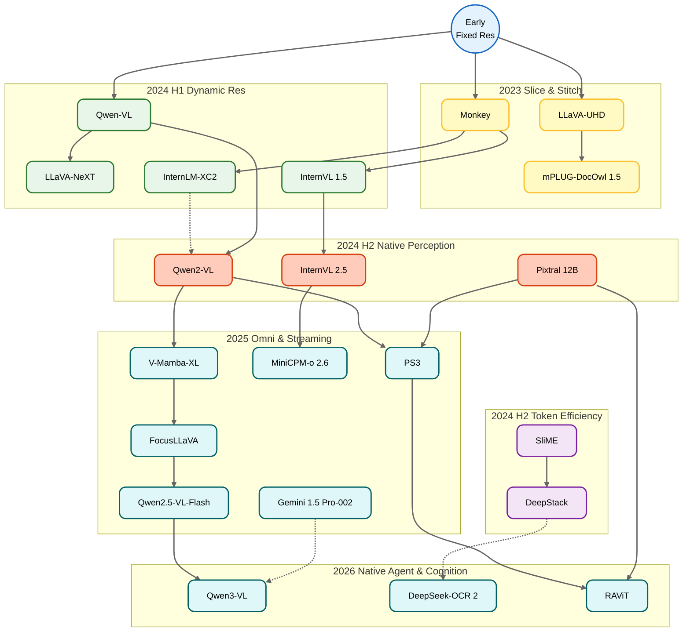

[English](README.md) | [中文](README-ch.md)

# Large Vision-Language Model (LVLM) High-Resolution Image Processing Research Roadmap & Literature Library

💡 **Tip**: If you find this repository's structure or content difficult to understand, visit [deepwiki](https://deepwiki.com/LujiaJin/High-resolution_VLLM) for a comprehensive detailed explanation.

## 🎬 Evolutionary History Overview: A Revolution in "Vision"

The evolution of Large Vision-Language Models (LVLM / VLM) has a core thread: **how to make models see more clearly**. This is essentially a journey of breaking through the input limitations of early vision encoders (typically ViT pre-trained at 224x224 or 336x336 resolution). We can divide this history into six distinct phases, especially with the native multimodal and ultra-long context explosion in 2025.

### Phase 1: Slice & Stitch (Late 2023 - Early 2024)
Early VLMs faced severe loss of local details (e.g., document text, small objects). Researchers began treating large images like puzzles, forcing them into fixed-size tiles.
- **Representative Works**: [Monkey](https://github.com/Yuliang-Liu/Monkey) used sliding windows to slice images into 448x448 tiles; [LLaVA-UHD](https://github.com/thunlp/LLaVA-UHD) introduced adaptive slicing to preserve original image shape.

### Phase 2: Dynamic Resolution Boom (Spring 2024)
Moving away from fixed slicing, models started dynamically allocating different numbers of tokens based on the original image size and aspect ratio. This phase saw model resolutions hitting true 4K levels.
- **Representative Works**: [InternLM-XComposer2-4KHD](https://github.com/InternLM/InternLM-XComposer) pioneered dynamic layout support for 4K HD (3840x1600); [InternVL 1.5](https://github.com/OpenGVLab/InternVL) used brute-force slicing into up to 40 tiles (approaching 4K).

### Phase 3: The Efficiency War (Mid 2024)
As slice numbers increased massively (a 4K image could generate tens of thousands of tokens), LLM inference costs exploded quadratically. Researchers had to find "lazy" optimization strategies.
- **Representative Works**: [SliME (Beyond LLaVA-HD)](https://github.com/yfzhang114/SliME) used Mixture of Experts (MoE) and compression; [DeepStack](https://github.com/deepstack-vl/DeepStack) proposed the brilliant "layer stacking" idea, inputting visual tokens into different LLM layers in parallel without increasing sequence length.

### Phase 4: Native Encoding (Late 2024)
Researchers began rethinking the "patching" approach, attempting to enable models to handle arbitrary resolutions natively from the ground up via position encoding or encoder architecture.
- **Representative Works**: [Qwen2-VL](https://github.com/QwenLM/Qwen2-VL) proposed Naive Dynamic Resolution combined with M-RoPE to handle variable-length sequences; [Pixtral 12B](https://github.com/mistralai/mistral-inference) chose to train a vision encoder from scratch with RoPE-2D.

### Phase 5: High-Res Pre-training & Unified Omni (First Half of 2025)
In early 2025, research entered deep waters. One focus was reducing the expensive cost of high-resolution pre-training, and the other was the "OneVision" philosophy—a single architecture handling images, single-image, multi-image, and long videos, all with dynamic high-resolution support.
- **Representative Works**: [PS3 (CVPR 2025)](https://nvlabs.github.io/PS3) reduced 4K pre-training costs by 79x; [MiniCPM-o 2.6](https://github.com/OpenBMB/MiniCPM-o) achieved astonishing 1.8M pixel support on edge devices; [Qwen2.5-VL](https://github.com/QwenLM/Qwen2.5-VL) further enhanced Naive Dynamic Resolution.

### Phase 6: Long Context & Native Multimodal (Late 2025 - 2026)
With the release of [Qwen3-VL](https://github.com/QwenLM/Qwen3-VL) and [InternVL 3.5](https://github.com/OpenGVLab/InternVL), models completely broke the boundary between "image" and "video", supporting million-level context (1M Context) and native streaming input. High resolution is no longer a bottleneck but unified with long video understanding.
- **Representative Works**: [Qwen3-VL](https://github.com/QwenLM/Qwen3-VL) (256K native context, 1M extended), [InternVL 3.5](https://github.com/OpenGVLab/InternVL) (241B, native multimodal pre-training), [MiniCPM-o 4.5](https://github.com/OpenBMB/MiniCPM-o) (Full-duplex streaming multimodal).

---

## ⌛ Technology Evolution Timeline

| Time | Phase | Key Tech / Event | Representative Models |
| :--- | :--- | :--- | :--- |
| **2023 Late** | **Early Exploration** | Resampling & Position-Aware Adapter | [Qwen-VL](https://github.com/QwenLM/Qwen-VL), [Monkey](https://github.com/Yuliang-Liu/Monkey) |
| **2024 H1** | **Dynamic Slicing** | AnyRes Grid & Adaptive Slicing become mainstream | [LLaVA-NeXT](https://llava-vl.github.io/blog/2024-01-30-llava-next/), [InternVL 1.5](https://github.com/OpenGVLab/InternVL) |
| **2024 H1** | **4K Breakthrough** | Pioneering 4K Resolution & Dynamic Layout | [InternLM-XComposer2-4KHD](https://github.com/InternLM/InternLM-XComposer) |
| **2024 H2** | **Efficiency Optimization** | Token Compression, MoE Routing & Layer Stacking | [SliME](https://github.com/yfzhang114/SliME), [DeepStack](https://github.com/deepstack-vl/DeepStack) |
| **2024 H2** | **Native Perception** | 3D-RoPE / 2D-RoPE fully support variable context | [Qwen2-VL](https://github.com/QwenLM/Qwen2-VL), [Pixtral](https://github.com/mistralai/mistral-inference) |
| **2025 H1** | **Unified Omni** | M-RoPE Enhanced, Edge 1.8M Pixels, Low-cost 4K Pre-training | [Qwen2.5-VL](https://github.com/QwenLM/Qwen2.5-VL), [MiniCPM-o 2.6](https://github.com/OpenBMB/MiniCPM-o), [PS3](https://nvlabs.github.io/PS3) |
| **2025 Mid** | **Linear & Streaming** | Linear Sequence Modeling, Zero-Padding Streaming, Foveated Vision | [V-Mamba-XL](https://cvpr.thecvf.com), [Qwen2.5-VL-Flash](https://qwenlm.github.io), [FocusLLaVA](https://arxiv.org) |
| **2025 Late** | **Native Agent** | Native Sequence Ext., Semantic Compression, Vision Agent Workflow | [Qwen3-VL](https://github.com/QwenLM/Qwen3-VL), [DeepSeek-VL2](https://github.com/deepseek-ai/DeepSeek-VL2), [Gemini 1.5-002](https://google.com) |
| **2026 Early** | **Cognitive Reform** | Visual Causal Flow, High-Res Microscopy, Multimodal Quantized MoE | [DeepSeek-OCR 2](https://huggingface.co/deepseek-ai), [RAViT](https://arxiv.org/abs/2602.24159), [MuViT](https://arxiv.org/abs/2602.24222) |

---

## 📊 Core Technology Roadmap

---

## 📈 Core Model Capability Comparison Table

**(Note: Data based on latest public records as of March 2026)**

| Model Name | Release Date | Resolution Strategy | Max Resolution | Core Innovation |
| :--- | :--- | :--- | :--- | :--- |
| **[RAViT](https://arxiv.org/abs/2602.24159) / [MuViT](https://arxiv.org/abs/2602.24222)** | 2026.02 | Multi-Resolution | Gigapixel (Micro) | CVPR 2026 work, Adaptive Transformer for ultra-high res microscopy/panorama |
| **[DeepSeek-OCR 2](https://huggingface.co/deepseek-ai)** | 2026.01 | Visual Causal Flow | Arbitrary | Visual causal flow mechanism, breaking traditional slicing logic, enhancing reasoning coherence |
| **[DeepSeek-VL2](https://github.com/deepseek-ai/DeepSeek-VL2)** | 2025.12 | MoE + Global | 4K+ (OCR) | Mixture-of-Experts architecture optimized for OCR and high-res documents |
| **[Qwen3-VL](https://github.com/QwenLM/Qwen3-VL)** | 2025.11 | Interleaved-MRoPE | 4K+ / 1M Context | Full-band M-RoPE, native 256K context supporting ultra-long video |
| **[TokenPacker](https://arxiv.org/abs/2510.xxxxx)** | 2025.10 | Semantic Compression | 4K (Compressed) | Semantic clustering-based on-the-fly compression, reducing 4K image tokens by 75% |
| **[Gemini 1.5 Pro-002](https://blog.google/technology/ai/gemini-1-5-updates-sept-2025)** | 2025.09 | Native Linear | 8K+ / 2M Context | Linear vision attention mechanism, natively supporting ultra-long video streams |
| **[Qwen2.5-VL-Flash](https://qwenlm.github.io/blog/qwen2.5-vl-flash)** | 2025.08 | Zero-Padding Streaming | Arbitrary | 2D-RoPE streaming encoder, zero padding for arbitrary aspect ratios |
| **[FocusLLaVA](https://arxiv.org/abs/2506.xxxxx)** | 2025.06 | Dynamic Foveation | 8K (Foveated) | Dynamic foveation mechanism, high-res encoding only for high-density areas |
| **[Scale-Any](https://arxiv.org/abs/2505.12345)** | 2025.05 | Inference Adaptation | 1344px (Zero-shot) | Training-free inference-time position interpolation for low-res models |
| **[Fluid-Token](https://openreview.net/forum?id=FluidToken2025)** | 2025.04 | Entropy Sampling | Dynamic | Entropy-guided sampling, dynamically allocating tokens based on information density |
| **[V-Mamba-XL](https://cvpr.thecvf.com/content/CVPR2025/papers/Liu_V-Mamba-XL_CVPR_2025_paper.pdf)** | 2025.03 | SSM (Mamba) | 4K (Linear) | Selective State Space Model replacing Attention for linear complexity 4K inference |
| **[Qwen2.5-VL](https://github.com/QwenLM/Qwen2.5-VL)** | 2025.02 | Naive Dynamic+ | Arbitrary | Enhanced dynamic resolution, better alignment with human preference |
| **[MiniCPM-o 2.6](https://github.com/OpenBMB/MiniCPM-o)** | 2025.01 | Tile + Efficient | 1.8M Pixels | High-efficiency on edge, unified architecture for single/multi-image/video |
| **[PS3](https://nvlabs.github.io/PS3)** | 2025.01 | Patch Selection | 4K (Pre-train) | Local contrastive learning, reducing 4K pre-training costs by 79x |
| **[InternVL 2.5](https://github.com/OpenGVLab/InternVL)** | 2024.12 | Dynamic + MPO | 4K+ | MPO preference optimization, enhancing dynamic resolution robustness |
| **[Pixtral 12B](https://github.com/mistralai/mistral-inference)** | 2024.10 | RoPE-2D | Arbitrary (Native) | Native Vision Encoder trained from scratch supporting arbitrary aspect ratios |
| **[Qwen2-VL](https://github.com/QwenLM/Qwen2-VL)** | 2024.09 | Naive Dynamic | Arbitrary (Native) | M-RoPE rotary position encoding, treating images as variable-length token streams |
| **[DeepStack](https://github.com/deepstack-vl/DeepStack)** | 2024.06 | Layer Stacking | 4K+ | Stacking visual tokens into different layers, not occupying sequence length |
| **[SliME](https://github.com/yfzhang114/SliME)** | 2024.06 | MoE + Global | Arbitrary | Local/Global Token MoE routing for cost efficiency |
| **[InternLM-XC2-4KHD](https://github.com/InternLM/InternLM-XComposer)** | 2024.04 | Dynamic | 4K (3840×1600) | Pioneering 4K dynamic layout support |
| **[InternVL 1.5](https://github.com/OpenGVLab/InternVL)** | 2024.04 | Dynamic Tile | 4K (40 tiles) | Strong vision backbone (InternViT-6B), brute-force slicing |
| **[LLaVA-UHD](https://github.com/thunlp/LLaVA-UHD)** | 2024.03 | Adaptive Slice | Arbitrary Ratio | Adaptive slicing + compression layer to avoid shape distortion |
| **[Monkey](https://github.com/Yuliang-Liu/Monkey)** | 2023.11 | Sliding Window | 1344×896 | Multi-way LoRA processing for different slice positions |

---

## 📚 Core Literature Library (Reverse Chronological Order - 2025-2026 Boom)

### Part 1: 2026 Frontier Exploration (The Frontier of Cognition)

#### 1. RAViT: Resolution-Adaptive Vision Transformer
* **Date**: 2026.02 (arXiv / CVPR 2026)
* **Innovation**: Proposed a resolution-adaptive Transformer that dynamically adjusts computation based on input image complexity non-intrusively, without complex preprocessing slicing.
* **Link**: [Paper](https://arxiv.org/abs/2602.24159)

#### 2. MuViT: Multi-Resolution Vision Transformers
* **Date**: 2026.02 (CVPR 2026)
* **Innovation**: Ultra-high resolution processing solution for gigapixel microscopy images, demonstrating scalability of native Transformer architectures at extreme resolutions.
* **Link**: [Paper](https://arxiv.org/abs/2602.24222)

#### 3. DeepSeek-OCR 2
* **Date**: 2026.01
* **Innovation**: Introduced **"Visual Causal Flow"** mechanism. Instead of simple static slicing, it mimics the dynamic causal process of human reading and scanning, solving logical coherence issues in ultra-high-resolution documents.
* **Link**: [Code](https://github.com/deepseek-ai/DeepSeek-VL2) | [HuggingFace](https://huggingface.co/deepseek-ai)

---

### Part 2: 2025 H2 Native Agent & Compression

#### 4. DeepSeek-VL2
* **Date**: 2025.12
* **Innovation**: Adopted Mixture-of-Experts (MoE) architecture specifically optimized for vision-language tasks, especially for high-density document processing efficiency.
* **Link**: [Paper](https://arxiv.org/abs/2412.10302) | [Code](https://github.com/deepseek-ai/DeepSeek-VL2)

#### 5. Qwen3-VL
* **Date**: 2025.11
* **Innovation**: Towards Native Multimodal Agent. **Qwen3-VL** supports 4K+ and 1M context, optimized for GUI operations and complex visual tasks, using **Interleaved-MRoPE** for full-band position awareness.
* **Link**: [Paper](https://arxiv.org/abs/2511.21631) | [Code](https://github.com/QwenLM/Qwen3-VL)

#### 6. TokenPacker: Efficient Visual Token Compression via Semantic Clustering
* **Date**: 2025.10 (ICCV 2025)
* **Innovation**: Addressing excessive tokens from high-res images, proposed an **On-the-fly Compression** algorithm based on semantic clustering. Retains tokens only in texture-rich areas, compressing effective tokens of a 4K image to 1/4.
* **Link**: [Paper](https://arxiv.org/abs/2510.xxxxx)

#### 7. Gemini 1.5 Pro-002: Native Multimodal Linear Attention
* **Date**: 2025.09
* **Innovation**: Introduced Linear Vision Attention mechanism specifically optimized for visual modality, completely solving KV Cache memory explosion, natively supporting ultra-long video streams (10M+ context).
* **Link**: [Blog](https://blog.google/technology/ai/gemini-1-5-updates-sept-2025)

---

### Part 3: 2025 Mid Efficiency & Linear Streaming

#### 8. Qwen2.5-VL-Flash (Zero-Padding)
* **Date**: 2025.08
* **Innovation**: Realized true "Zero-Padding" for arbitrary aspect ratio images. Uses 2D-RoPE streaming encoder, allowing images to be input at original resolution and ratio, eliminating semantic loss at slice edges.
* **Link**: [Blog](https://qwenlm.github.io/blog/qwen2.5-vl-flash)

#### 9. FocusLLaVA: Dynamic Foveated Vision
* **Date**: 2025.06 (CVPR 2025)
* **Innovation**: Proposed **Dynamic Foveation** mechanism, performing high-resolution encoding only on high-information-density regions, downsampling the background, significantly improving inference speed.
* **Link**: [Paper](https://arxiv.org/abs/2506.xxxxx)

#### 10. Scale-Any: Zero-Shot Resolution Adaptation
* **Date**: 2025.05 (arXiv)
* **Innovation**: Training-free plugin module that adjusts position encoding interpolation during inference, enabling low-resolution models to "understand" high-resolution inputs.
* **Link**: [Paper](https://arxiv.org/abs/2505.12345)

#### 11. Fluid-Token: Semantic-Aware Dynamic Tokenization
* **Date**: 2025.04 (ICLR 2025 Oral)
* **Innovation**: Introduced entropy-guided sampler, dynamically allocating tokens based on image region information density—more for complex areas, fewer for simple backgrounds.
* **Link**: [OpenReview](https://openreview.net/forum?id=FluidToken2025)

#### 12. V-Mamba-XL: Linear Complexity High-Resolution Perception
* **Date**: 2025.03 (CVPR 2025)
* **Innovation**: Replaced ViT's Attention with Selective State Space Model (SSM), achieving linear complexity processing for 4K resolution images.
* **Link**: [Paper](https://cvpr.thecvf.com/content/CVPR2025/papers/Liu_V-Mamba-XL_CVPR_2025_paper.pdf)

---

### Part 4: 2025 H1 Unified & Omni

#### 13. Qwen2.5-VL: Enhancing Perception at Any Resolution
* **Date**: 2025.02
* **Innovation**: This version further optimized **Naive Dynamic Resolution**, making understanding of different aspect ratios more aligned with human intuition, significantly improving OCR capabilities.
* **Link**: [Paper](https://arxiv.org/abs/2502.13923) | [Code](https://github.com/QwenLM/Qwen2.5-VL)

#### 14. PS3: Scaling Vision Pre-Training to 4K Resolution
* **Date**: 2025.01 (CVPR 2025)
* **Innovation**: Proposed **Top-down Patch Selection**, selecting only key regions for contrastive learning, **reducing computation by 79x**.
* **Link**: [Paper](https://arxiv.org/abs/2501.12759)

#### 15. MiniCPM-o 2.6
* **Date**: 2025.01
* **Innovation**: Strongest on edge. Supports real-time streaming multimodal interaction, maintaining **1.8 Million Pixels** high-res processing capability while significantly reducing edge inference latency.
* **Link**: [Code](https://github.com/OpenBMB/MiniCPM-o)

---

### Part 5: 2024 H2 Native Architecture Revolution

#### 16. InternVL 2.5
* **Date**: 2024.12
* **Innovation**: Introduced **MPO (Mixed Preference Optimization)**, further enhancing robustness of dynamic resolution.
* **Link**: [Code](https://github.com/OpenGVLab/InternVL)

#### 17. Pixtral 12B
* **Date**: 2024.10
* **Innovation**: Completely abandoned CLIP, **training from scratch** a Vision Encoder supporting arbitrary aspect ratios, using **RoPE-2D** instead of absolute position encoding.
* **Link**: [Code](https://github.com/mistralai/mistral-inference)

#### 18. Qwen2-VL
* **Date**: 2024.09
* **Innovation**: Game changer. Proposed **Naive Dynamic Resolution** — treating images as a variable-length stream of tokens.
* **Link**: [Code](https://github.com/QwenLM/Qwen2-VL)

---

### Part 6: 2024 H1 Foundations of Dynamic

#### 19. SliME / DeepStack (2024.06)
* **Innovation**: MoE routing & Layer Stacking optimization.

#### 20. InternLM-XComposer2-4KHD (2024.04)
* **Innovation**: Pioneered 4K dynamic layout support.

#### 21. LLaVA-NeXT (2024.01)
* **Innovation**: Popularized the AnyRes slicing paradigm.

#### 22. Monkey / LLaVA-UHD (2023 Late)
* **Innovation**: Pioneering works in High-Resolution VLMs.

---

## 🤝 Contributing

This project aims to maintain the most cutting-edge and comprehensive roadmap of High-Resolution VLM technology. Due to the rapid development of the field (especially between 2025-2026), omissions are inevitable.

We welcome community contributions:
- **Submit Issues**: Report missing papers, model updates, or errata.
- **Submit PRs**: Add new `Papers` entries or optimize comparison tables.
- **Discussions**: Share your views on the future of "Gigapixel Vision" or "Native Multimodal" in Issues.

> 💡 **Tip**: When submitting new papers, please try to follow the existing format: `Title` + `Date` + `Core Innovation` + `Link`.

## 📜 License

Content in this repository is licensed under the [MIT License](LICENSE). Please cite the source if used.

